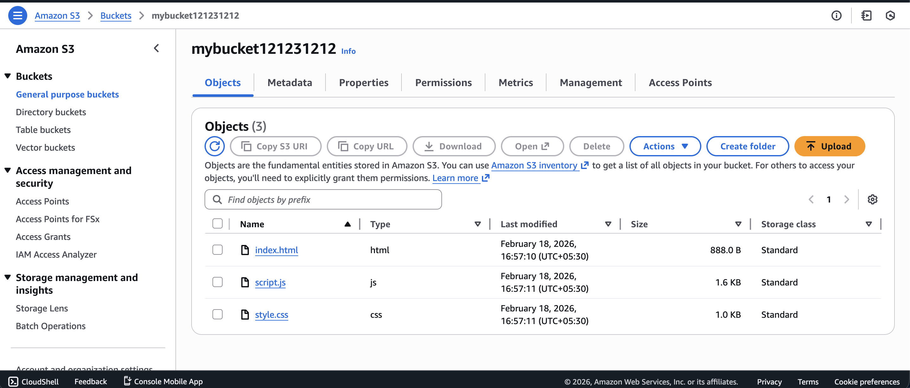
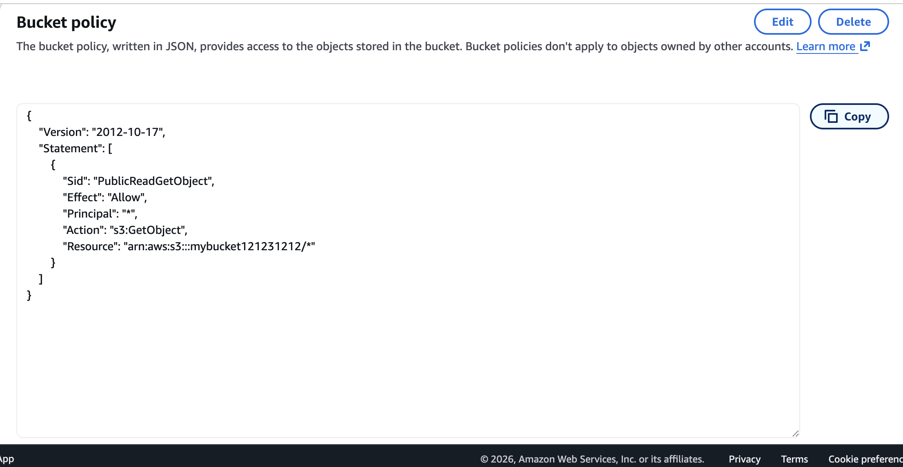
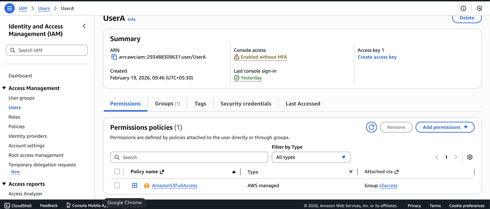
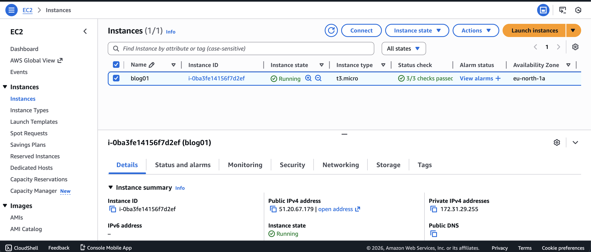
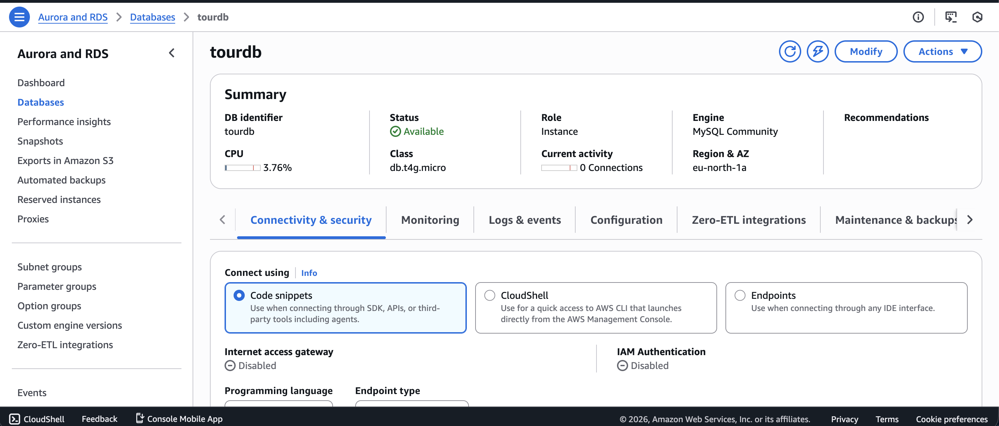
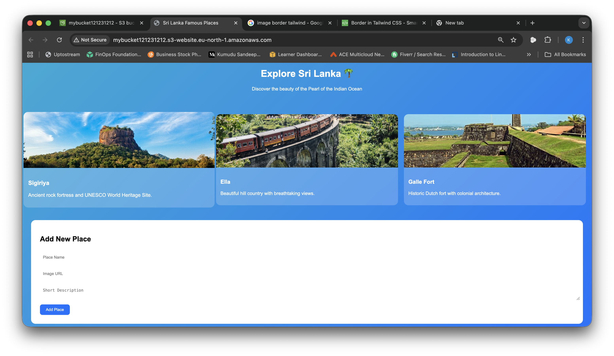

# ☁️ AWS Cloud Computing 101 – Hands-On Implementation

🎓 Completed AWS Educate – Cloud Computing 101  
This repository documents my practical experience implementing core AWS cloud services.

---

## 📌 Project Objective

The goal of this project was to gain foundational knowledge of cloud computing concepts and apply them using Amazon Web Services (AWS).

This project demonstrates hands-on experience with infrastructure setup, access control, compute services, database services, and static website hosting.

---

# 🚀 AWS Services Implemented

## 🔹 Amazon S3
Used to store and host static website files (HTML, CSS, JavaScript).

## 🔹 AWS IAM
Configured IAM users and attached policies to manage secure access to AWS resources.

## 🔹 Amazon EC2
Launched and monitored a virtual server instance in the cloud.

## 🔹 Amazon RDS (MySQL)
Created a managed relational database instance.

---

# 💻 Practical Implementation

✔ Uploaded website files to S3  
✔ Configured bucket policy for public read access  
✔ Enabled Static Website Hosting  
✔ Created IAM user with required permissions  
✔ Launched EC2 instance (t3.micro)  
✔ Created RDS MySQL database  

---

# 🌐 Static Website Hosting Configuration

The S3 bucket was configured as follows:

- Hosting Type: Host a static website  
- Index Document: index.html  
- Public Access: Enabled via Bucket Policy  
- Access Method: S3 Website Endpoint  

This allows public users to access the website hosted on AWS infrastructure.

---

# 📸 Screenshots & Explanation

## 1️⃣ S3 Bucket Configuration



The S3 bucket contains website files (`index.html`, `style.css`, `script.js`) and is configured for static hosting.

---

## 2️⃣ S3 Bucket Policy



The bucket policy grants public read access using:

```json
{
  "Effect": "Allow",
  "Principal": "*",
  "Action": "s3:GetObject",
  "Resource": "arn:aws:s3:::your-bucket-name/*"
}
```

This enables static website access while restricting write operations.

---

## 3️⃣ IAM User Configuration



IAM user created with appropriate AWS managed policies to control secure resource access.

---

## 4️⃣ EC2 Instance Running



An EC2 instance was launched and verified in running state.

---

## 5️⃣ RDS Database Instance



A MySQL RDS instance was configured and successfully deployed.

---

## 6️⃣ Website Deployment via S3 Endpoint
![Website] (screenshots/static.png)



The website is accessible using the official S3 Website Endpoint after enabling static website hosting.

---

# 🧠 Key Concepts Learned

- Cloud Computing Models (IaaS, PaaS, SaaS)
- AWS Global Infrastructure
- IAM Access Control
- Resource-Based vs Identity-Based Policies
- Static Website Hosting Architecture
- Managed Database Deployment
- Cloud Security Fundamentals

---

# 🔐 Security Considerations

- Public access limited to `s3:GetObject` only
- No public write permissions
- Followed least privilege principle in IAM
- Sensitive credentials not exposed

---

# 🎯 Future Improvements

- Connect EC2 application to RDS
- Use IAM Roles instead of direct user access
- Add CloudFront for HTTPS
- Configure VPC security groups properly
- Implement CI/CD deployment pipeline

---

# 👩‍💻 Author

**Kumudu Amarakoon**  
BICT Undergraduate  
Cloud & Software Engineering Enthusiast  

---

⭐ This project demonstrates foundational AWS cloud implementation and practical infrastructure configuration.
